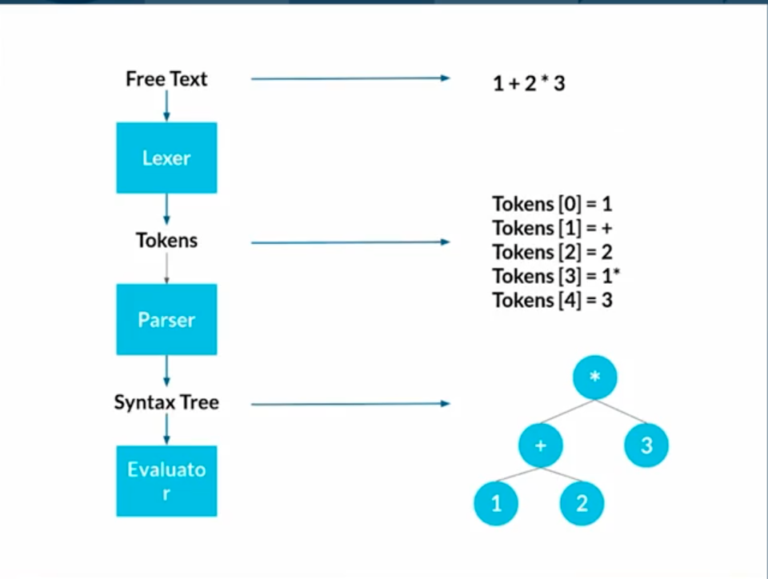

nosetests
mypy . && nosetests

https://docs.python.org/3/library/venv.html

source <venv>/bin/activate

A los lenguajes de programación los podemos agrupar en 2 grandes grupos:
 
*  Los lenguajes interpretados
*  Los lenguajes compilados

En este proyecto crearemos un lenguaje interpretado, 100% en español.

Además de crear este lenguaje se intentarán explicar brevemente las bases del mismo.

**Componentes:**

*  Lexer
*  Parser
*  Abstrac Syntax Tree(AST)
*  Representación interna de objetos
*  Evaluador
*  Repl

**Pasos que tiene que ejecutar nuestro intérprete**

1.  Análisis léxico

# Análisis léxico
 
Es el procedimiento mediante el cual se convierte una secuencia de caracteres en tokens con un significado determinado.
 
Identifica los componentes básicos de nuestro programa e identifica su significado.
 
Cada token tiene un nombre y un valor.

En este primer momento no nos preocupamos por si la estructura del programa es correcta, solo nos preocupamos por identificar los pedazos primitivos del programa. Eventualmente estos primitivos se los pasaremos al parser y este se encargará de validar por la estructura del programa.

Proceso del análisis léxico

## Token
El token es un identificador el cual representa los componentes/símbolos de nuestro lenguaje.

Los token de nuestro lenguaje se encuentra representado dentro del **Enum TokenType** en el archivo **lpp/token.py**  

## Laxer
Componente que se encarga de procesar caracter por caracter, para convertirlos en token

---

# Análisis sintático

## Parser

Es un componente que analiza estructuras de datos (Token) para determinar
si su orden se apega a una gramática formal. Verificas su sintaxis y lista los errores gramaticales.

genera un parse tree que señala la relación entre los diferentes componentes.
En nuestro caso, genera un Abstrac Syntax Tree (AST), el echo de que nuestro AST sea obstracto es una caracteristica muy importante ya que significa que no le importa los valores de los token (si es un ; + var), pero si lo utiliza para validar si la secuencia es valida.

Como se menciona el AST es un arbol abstracto, una pregunta que nos puede surgir es que contiene este arbol. Pues el contenido del AST no es más que un conjunto de nodos los cuales contendran las sentencias (Statement) de nuestro programa.

<agregar ejemplo de ast>

    ASTNode
        |--> Statement(token:Token)
                |--> Block(statements: List[Statement])
                |--> ExpressionStatement(expression: Optional[Expression])
                |--> LetStatement(name: Optional[Identifier], value: Optional[Expression])
                |--> ReturnStatement(return_value: Optional[Expression])
        |--> Expression(token:Token)
                |--> Boolean(value: Optional[bool])
                |--> Call(function: Expression,
            arguments: Optional[List[Expression]])
                |--> Function(parameters: List[Identifier] = [],body: Optional[Block])
                |--> Identifier(value:str)
                |--> Integer(value: Optional[int])
                |--> Infix(left: Expression, operator: str, right: Optional[Expression])
                |--> If(condition: Optional[Expression] = None, consequence: Optional[Block] =  None, alternative: Optional[Block] = None)
                |--> Prefix(operator: str, right: Optional[Expression])
        |--> Program(statements:Statement)

## Analisis semantico  

Es realizar el analisis del significado de los símbolos. ES donde 
se implemeta la semántica del lenguaje.

Es donde una expresion como 2 + 2 pasa de ser solo una serie de 
caracteres, tokens y árboles a un probrama.

Este proceso es el que define cómo funciona el lenguaje de programación.

### Estrategia de evaluación

La evaluación es donde más se diferen las implementaciones de los intérpretes (sin importar el lenguaje).

La línea entre intérpretes y compiladores es borrosa. En realidad es un continuo.

Estrategias:

* Tree walking interpreter --> java script
* AST - Bytecode - Virtual machine --> python
* Bytecode directamente --> java
* AST - Bytecode - JIT - machine code --> Dark
* AST - machine code directamente
* Tree walking y hot compilation

La ídea es entender de que existen muchas extrategias y que la separacion entre interpretes y compiladores no es tan clara hoy en día.

Tree walking interpreter:

## REPL
read evaluate print loop

  