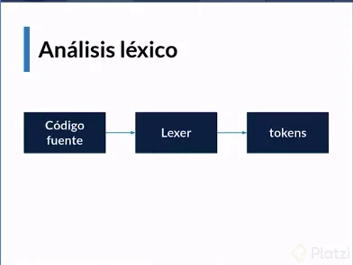
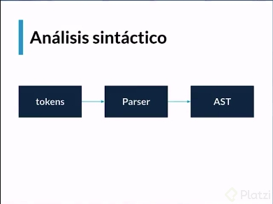

nosetests
mypy . && nosetests

# Análisis léxico

## Token
Identificador de cada componente de nuesto lenguaje.

Ejemplo:

    * while
    * for
    * if

## Laxer
Componente que se encarga de procesar caracter por caracter, para convertirlos en token

    source --> Lexer --> Token

## REPL
read evaluate print loop

# Análisis sintático

## Parser

Es un componente que analiza estructuras de datos (Token) para determinar
si su orden se apega a una gramática formal. Verificas su sintaxis

genera un paarse tree que señala la relación entre los diferentes componentes.
En nuestro caso, genera un Abstrac Syntax Tree (AST)

